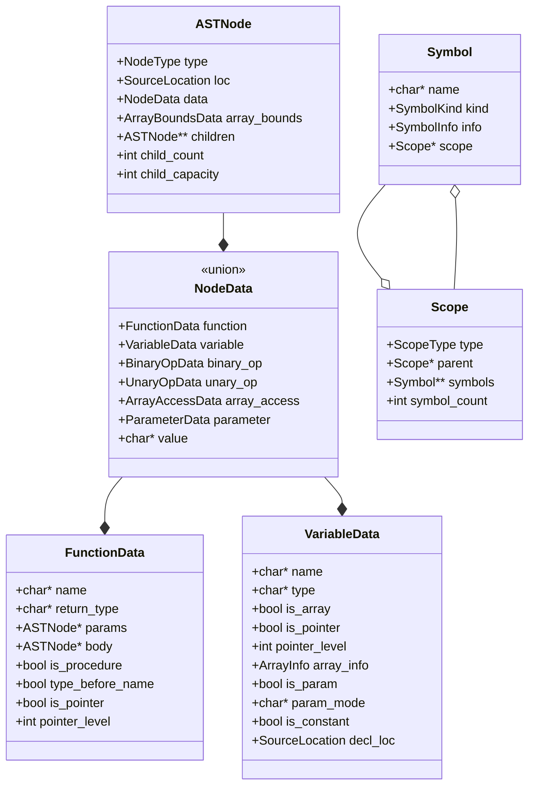
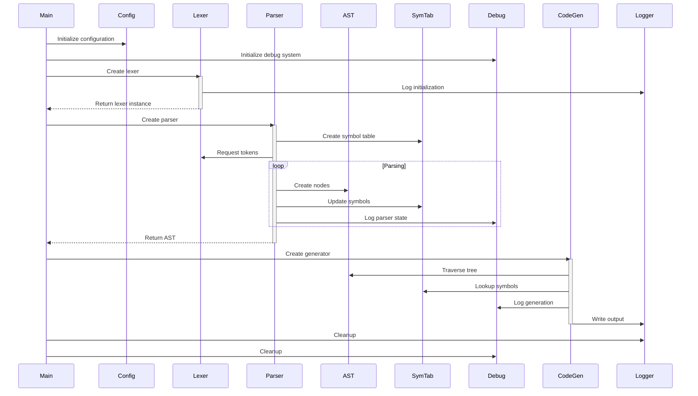
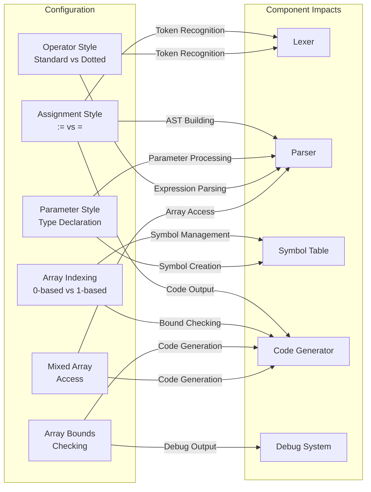
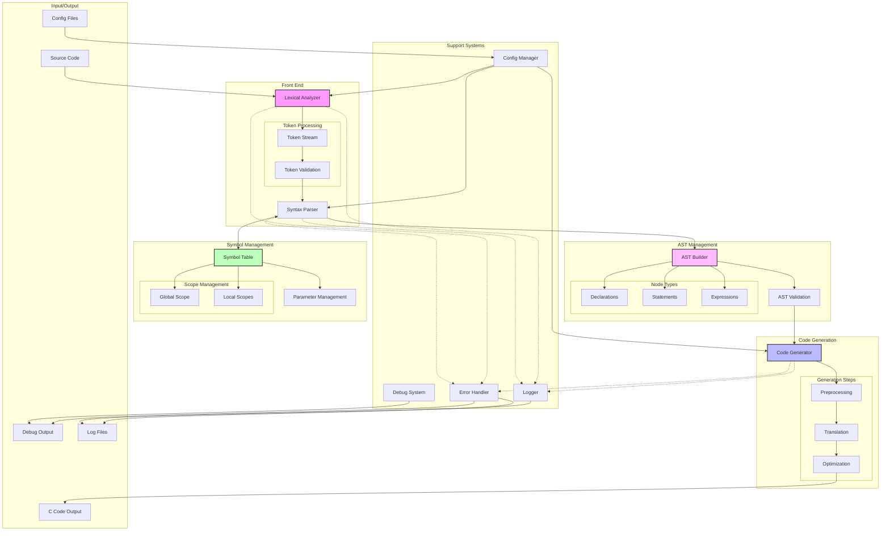

# P-Like Language to C Translator

A source-to-source compiler that translates programs written in a Pascal-like language into equivalent C code. The translator supports various language features including procedures, functions, arrays (multi-dimensional), parameter passing modes (in/out/inout), and more.

## Requirements

- C compiler (gcc or clang)
- Make build system
- (Optional) Graphviz for debug visualization

## Building

```bash
# Clone the repository
git clone https://github.com/yourusername/plike-translator
cd plike-translator

# Build the project
make

# Optional: Build with debug features
make debug
```

## Usage

```bash
# Basic usage
./plike input.p output.c

# With array bounds checking enabled
./plike --bounds-check input.p output.c

# With verbose output
./plike --verbose input.p output.c
```

## Language Features

<details>
<summary>Click to expand language features</summary>

### Basic Syntax
```pascal
// Function declaration
function sum(in a: integer, in b: integer): integer
begin
    sum := a + b;
end sum

// Procedure declaration
procedure swap(inout x: integer, inout y: integer)
var temp: integer;
begin 
    temp := x;
    x := y;
    y := temp;
end swap
```

### Array Operations
```pascal
// Fixed-size arrays
var arr: array[10] of integer;

// Range-based arrays
var matrix: array[1..5, 1..5] of real;

// Dynamic arrays
var dynamic: array[n] of integer;
```

### Parameter Passing Modes
- `in`: Pass by value (default)
- `out`: Pass by reference (write-only)
- `inout`: Pass by reference (read/write)

### Control Structures
- `if`/`elseif`/`else`/`endif`
- `while`/`endwhile`
- `for`/`endfor`
- `repeat`/`until`

</details>

## Architecture

<details>
<summary>Click to expand architecture diagrams</summary>

### AST Structure



### Component Interactions



### Configuration Impact



### Translator Architecture



</details>

## Configuration Options

The translator supports various configuration options that affect how the code is processed and generated:

- Assignment style (`:=` vs `=`)
- Array indexing (0-based vs 1-based)
- Parameter style (type declaration location)
- Operator style (standard vs dotted logical operators)
- Array bounds checking
- Mixed array access syntax (`[]` and `()`)

## Contributing

Contributions are welcome! Please read our contributing guidelines before submitting pull requests.

## License

This project is licensed under the MIT License - see the LICENSE file for details.
