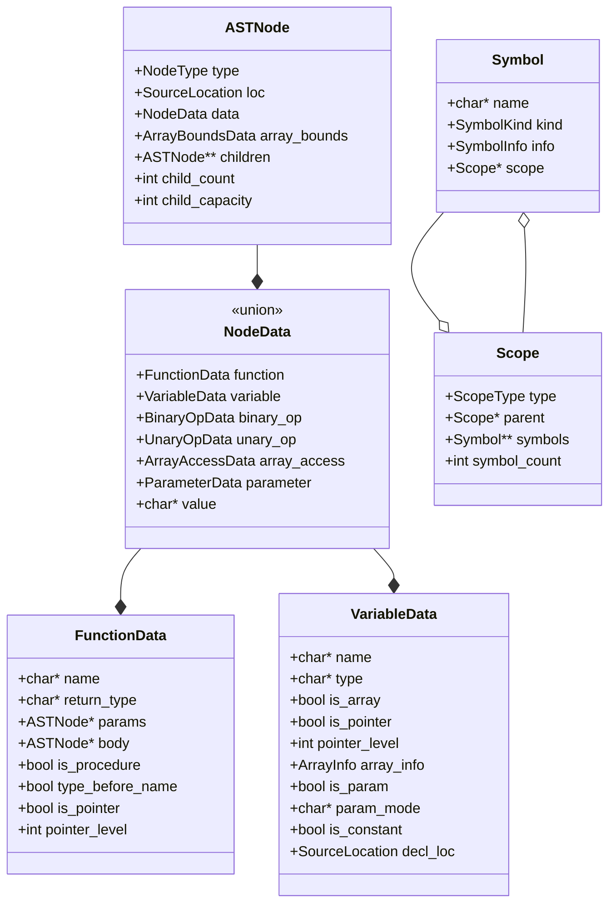

```mermaid
classDiagram
    class ASTNode {
        +NodeType type
        +SourceLocation loc
        +NodeData data
        +ArrayBoundsData array_bounds
        +ASTNode** children
        +int child_count
        +int child_capacity
    }

    class NodeData {
        <<union>>
        +FunctionData function
        +VariableData variable
        +BinaryOpData binary_op
        +UnaryOpData unary_op
        +ArrayAccessData array_access
        +ParameterData parameter
        +char* value
    }

    class FunctionData {
        +char* name
        +char* return_type
        +ASTNode* params
        +ASTNode* body
        +bool is_procedure
        +bool type_before_name
        +bool is_pointer
        +int pointer_level
    }

    class VariableData {
        +char* name
        +char* type
        +bool is_array
        +bool is_pointer
        +int pointer_level
        +ArrayInfo array_info
        +bool is_param
        +char* param_mode
        +bool is_constant
        +SourceLocation decl_loc
    }

    class Symbol {
        +char* name
        +SymbolKind kind
        +SymbolInfo info
        +Scope* scope
    }

    class Scope {
        +ScopeType type
        +Scope* parent
        +Symbol** symbols
        +int symbol_count
    }

    ASTNode --* NodeData
    NodeData --* FunctionData
    NodeData --* VariableData
    Symbol --o Scope
    Scope --o Symbol
```