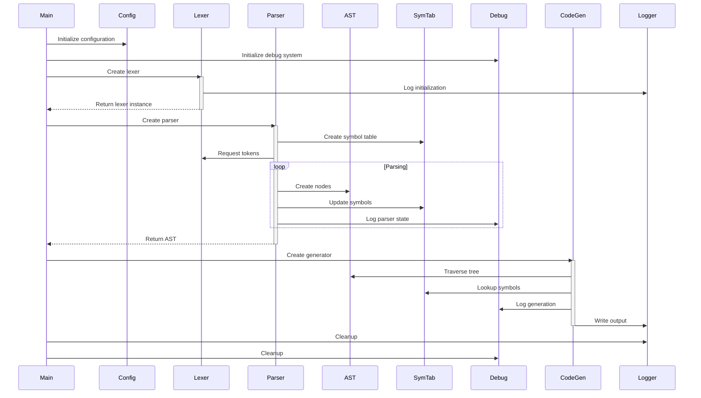

```mermaid
sequenceDiagram
    participant Main
    participant Config
    participant Lexer
    participant Parser
    participant AST
    participant SymTab
    participant Debug
    participant CodeGen
    participant Logger

    Main->>Config: Initialize configuration
    Main->>Debug: Initialize debug system
    Main->>Lexer: Create lexer
    
    activate Lexer
    Lexer->>Logger: Log initialization
    Lexer-->>Main: Return lexer instance
    deactivate Lexer

    Main->>Parser: Create parser
    activate Parser
    Parser->>SymTab: Create symbol table
    Parser->>Lexer: Request tokens
    loop Parsing
        Parser->>AST: Create nodes
        Parser->>SymTab: Update symbols
        Parser->>Debug: Log parser state
    end
    Parser-->>Main: Return AST
    deactivate Parser

    Main->>CodeGen: Create generator
    activate CodeGen
    CodeGen->>AST: Traverse tree
    CodeGen->>SymTab: Lookup symbols
    CodeGen->>Debug: Log generation
    CodeGen->>Logger: Write output
    deactivate CodeGen

    Main->>Logger: Cleanup
    Main->>Debug: Cleanup
```