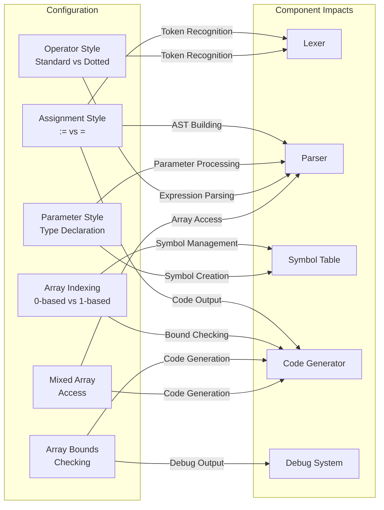

```mermaid
flowchart LR
    subgraph Configuration
        direction TB
        assign[Assignment Style<br>:= vs =]
        array[Array Indexing<br>0-based vs 1-based]
        param[Parameter Style<br>Type Declaration]
        op[Operator Style<br>Standard vs Dotted]
        bounds[Array Bounds<br>Checking]
        mixed[Mixed Array<br>Access]
    end

    subgraph "Component Impacts"
        direction TB
        lex[Lexer]
        parse[Parser]
        sym[Symbol Table]
        code[Code Generator]
        debug[Debug System]
    end

    assign -->|Token Recognition| lex
    assign -->|AST Building| parse
    assign -->|Code Output| code
    
    array -->|Symbol Management| sym
    array -->|Bound Checking| code
    
    param -->|Parameter Processing| parse
    param -->|Symbol Creation| sym
    
    op -->|Token Recognition| lex
    op -->|Expression Parsing| parse
    
    bounds -->|Code Generation| code
    bounds -->|Debug Output| debug
    
    mixed -->|Array Access| parse
    mixed -->|Code Generation| code
```