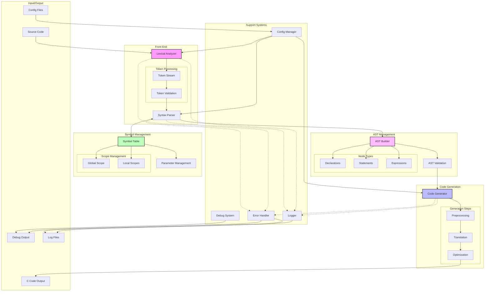

```mermaid
flowchart TB
    subgraph Input/Output
        src[Source Code]
        cfg[Config Files]
        out[C Code Output]
        debug[Debug Output]
        logs[Log Files]
    end

    subgraph "Front End"
        direction TB
        lexer[Lexical Analyzer]
        subgraph "Token Processing"
            tok_stream[Token Stream]
            tok_valid[Token Validation]
        end
        parser[Syntax Parser]
    end

    subgraph "Symbol Management"
        direction TB
        symtab[Symbol Table]
        subgraph "Scope Management"
            global[Global Scope]
            local[Local Scopes]
        end
        param[Parameter Management]
    end

    subgraph "AST Management"
        direction TB
        ast[AST Builder]
        subgraph "Node Types"
            decl[Declarations]
            stmt[Statements]
            expr[Expressions]
        end
        valid[AST Validation]
    end

    subgraph "Code Generation"
        direction TB
        codegen[Code Generator]
        subgraph "Generation Steps"
            preproc[Preprocessing]
            trans[Translation]
            opt[Optimization]
        end
    end

    subgraph "Support Systems"
        direction TB
        debug_sys[Debug System]
        logger[Logger]
        error[Error Handler]
        config[Config Manager]
    end

    %% Input connections
    src --> lexer
    cfg --> config

    %% Front end flow
    lexer --> tok_stream
    tok_stream --> tok_valid
    tok_valid --> parser
    
    %% Parser connections
    parser --> ast
    parser <--> symtab
    
    %% Symbol table organization
    symtab --> global
    symtab --> local
    symtab --> param
    
    %% AST management
    ast --> decl
    ast --> stmt
    ast --> expr
    ast --> valid

    %% Code generation flow
    valid --> codegen
    codegen --> preproc
    preproc --> trans
    trans --> opt
    opt --> out

    %% Support system connections
    config --> lexer
    config --> parser
    config --> codegen
    
    error --> debug
    error --> logs
    
    logger --> logs
    debug_sys --> debug

    %% Debug/logging connections
    lexer -.-> logger
    parser -.-> logger
    codegen -.-> logger
    
    lexer -.-> error
    parser -.-> error
    codegen -.-> error
    
    style lexer fill:#f9f,stroke:#333,stroke-width:2px
    style codegen fill:#bbf,stroke:#333,stroke-width:2px
    style symtab fill:#bfb,stroke:#333,stroke-width:2px
    style ast fill:#fbf,stroke:#333,stroke-width:2px
```